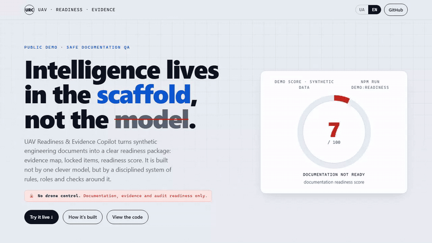

# UAV Readiness & Evidence Copilot

[Українська версія](README.uk.md)

> Evidence-first QA for UAV / robotics engineering documentation: evidence graph, locked findings, readiness score, traceability.
>
> **The intelligence is in the scaffold, not the model.**

[](https://github.com/DenisShumilov/uav-readiness-evidence-copilot/actions/workflows/ci.yml)
[](https://denisshumilov.github.io/uav-readiness-evidence-copilot/)
[](LICENSE)
[](#tech-stack)
[](#tech-stack)

**10** agents · **7** skills · **1** runtime gate · **94** tests · **5** export formats · **4** demo bundles · **2** languages

<p align="center">
  <a href="https://denisshumilov.github.io/uav-readiness-evidence-copilot/">
    
  </a>
</p>

*The strict demo deliberately scores 44/100 — no evidence means locked. The tool refuses to rubber-stamp.*

<p align="center">
  
</p>

## Run it on your own docs

### 1. One-minute CLI

```bash
npx github:DenisShumilov/uav-readiness-evidence-copilot check ./docs
```

Zero setup, instant output on the bundled strict bundle, no docs folder needed:

```bash
npx github:DenisShumilov/uav-readiness-evidence-copilot demo
```

For your own docs, `check <dir>` detects only these four contract-based inputs:

- BOM CSV: any `.csv` with `item_id,item_name,category,quantity,revision,record_status,evidence_id,notes`
- manual Markdown: `SYNTHETIC DEMO` line and a `| Claim | Status | Evidence |` table
- test-log CSV: any `.csv` with `check_id,check_name,check_type,result,evidence_status,evidence_id,notes`
- QA-notes Markdown: `SYNTHETIC DEMO` line, `| Evidence ID | Status | Meaning |` table, and `Finding ID` / `Status` / `Reason` / `Impact` fields

Detection is contract-based: anything else is reported as skipped, `--help` prints the contracts, and
missing evidence stays `locked` by design.

### 2. GitHub Action

```yaml
name: Docs Evidence

on: [pull_request]

jobs:
  readiness:
    runs-on: ubuntu-latest
    permissions:
      contents: read
      security-events: write
    steps:
      - uses: actions/checkout@v6
      - id: readiness
        uses: DenisShumilov/uav-readiness-evidence-copilot@main
        with:
          path: docs
          min-score: 70
      - uses: github/codeql-action/upload-sarif@v4
        with:
          sarif_file: ${{ steps.readiness.outputs.sarif }}
          category: uav-readiness
```

### 3. Bundled strict demo

```bash
npm run demo:readiness
```

**Try it in 10 seconds — no install:** https://denisshumilov.github.io/uav-readiness-evidence-copilot/ — an interactive dashboard: toggle evidence sources and watch the readiness score recompute while claims turn `locked`.

Built by a scaffold of 10 Claude subagents, 7 skills, and a runtime gate that blocks unsafe edits — [how it was built](docs/scaffold.en.md).

Give it a drone project's docs (parts list, manual, test log, QA notes) and it tells you — with proof — which claims are actually backed by evidence and how ready the documentation is.

UAV Readiness & Evidence Copilot turns synthetic engineering artifacts into an evidence-backed readiness package: parsed inputs, evidence graph, locked findings, traceability CSV, artifact hashes, SARIF for code scanning, markdown report, and a static portfolio demo. It is built not by one model, but by a scaffold of rules, roles, and checks around it.

## TL;DR

- Parses 4 synthetic inputs (BOM, manual, test log, QA notes).
- Builds an evidence graph for claims, sources, and locks.
- **Derives** each status from the evidence instead of trusting the reviewer's label: `no evidence -> locked`, with test-record claims graded by their own logged outcome.
- **A derived cross-document contradiction caps the verdict in the Blocked band even when every row is hand-marked "verified"** — the conflict demo scores **49/100 Blocked**.
- Computes a documentation readiness score with explainable, capped rules — and a parity test keeps the live site's formula identical to the engine.
- Exports a report, JSON, traceability CSV, artifact hashes, SARIF for code scanning, and a demo page.
- Also ships as a CLI and GitHub Action you can point at your own documentation folder.
- The point: reliability comes from the scaffold (rules, roles, checks, and a runtime gate), not the model.

## Demo Video

Final demo videos are published through GitHub Releases, not committed as binary files.

*Recorded from the current live site, including the evidence-graph and conflict-gate panels.*

- [Online demo page](https://denisshumilov.github.io/uav-readiness-evidence-copilot/)
- [Ukrainian MP4 demo](https://github.com/DenisShumilov/uav-readiness-evidence-copilot/releases/download/v0.7.0-demo-video/uav-readiness-demo.uk.final.mp4)
- [English MP4 demo](https://github.com/DenisShumilov/uav-readiness-evidence-copilot/releases/download/v0.7.0-demo-video/uav-readiness-demo.en.final.mp4)
- [Demo video release v7 (conflict gate + evidence graph)](https://github.com/DenisShumilov/uav-readiness-evidence-copilot/releases/tag/v0.7.0-demo-video)

## What It Does

- Parses 4 synthetic documentation inputs.
- Builds an evidence graph for claims, sources, and locks.
- Shows verified, partial, and locked evidence.
- Calculates a documentation readiness score.
- Generates markdown, JSON, CSV, SARIF for code scanning, and static HTML outputs.
- Runs through TypeScript, Vitest, npm audit, and GitHub Actions CI.

## Why It Matters

Engineering teams often have scattered documents, logs, and QA notes, but need a fast way to see what is actually supported by evidence.

This project demonstrates a safe internal-tool workflow for documentation readiness, audit preparation, and handoff review.

## Why this resonates in defense-tech documentation

Defense-tech documentation work is built around evidence packages: records, indexes, traceability, and review queues. This project mirrors that culture at toy scale by refusing to treat a claim as ready when its evidence is missing or contradictory. The new [Technical Data Package (TDP)-style supplier package demo](examples/demo-tdp-supplier-package/README.en.md) shows a recognizable intake scenario: a package arrives, a revision mismatch appears, and the score stays Blocked. See the category-level [standards crosswalk](docs/standards.en.md). No compliance claims are made.

Core rule:

```text
No evidence -> locked.
```

## Safety Boundaries

The strict safety boundary here is a **strength, not a disclaimer**: it shows engineering discipline and scope control. This is a documentation, QA, and portfolio project only.

It does not control drones or robots, process live telemetry, generate routes or waypoints, support payload operation, support targeting, provide tactical advice, or connect to real aircraft, radios, sensors, or field systems.

All demo data is synthetic, static, and educational.
It is enforced, not promised: a tested PreToolUse gate blocks any edit introducing operational terminology (see the committed sample log and `packages/qa/src/scaffoldGate.test.ts`).

## Quick Start

```bash
npm install
npm run demo:readiness
```

Open:

```text
examples/demo-uav-readiness/output/portfolio-demo.html
```

Run checks:

```bash
npm run typecheck
npm test
npm audit --audit-level=moderate
```

## Four demo bundles

- `npm run demo:readiness` — the strict `demo-uav-readiness` bundle (**44/100**, "not ready"): many gaps and locked items.
- `npm run demo:maintenance` — the mostly-organized `demo-maintenance-readiness` bundle (**80/100**, "reviewable, but incomplete"): same pipeline, different document shape, different result.
- `npm run demo:conflict` — the `demo-conflict-readiness` bundle (**49/100**): almost fully evidenced, but one **contradiction** between sources — the conflict gate caps the verdict in the Blocked band (deductions alone would give ~90).
- `npm run demo:tdp` — the `demo-tdp-supplier-package` bundle (**49/100**, Blocked): a Technical Data Package (TDP)-style supplier worksheet with two locked claims, one partial cross-reference, and a derived revision conflict.

This shows the tool generalizes and never rubber-stamps a score — it keeps claims `partial`/`locked` and refuses a "ready" verdict when sources disagree.

## Self-audit on real content

`npm run demo:selfaudit` points the **same engine** at this repository's own real documentation (not synthetic fixtures): it runs **10 checks** covering every documented demo score, the "10 agents / 7 skills" counts, the derived README test count, bilingual twins, referenced assets, and live-site release tags matching `README.md`. A clean repo scores **100/100 with zero overrides** — and the moment a doc drifts (a stale score, a missing twin, or a stale release tag), the engine overrides the documented claim (`verified -> locked`) and **CI fails**. This is the engine deriving a verdict on input it did not author.

> **What this does not yet prove:** the four demo bundles are synthetic and internally consistent, so on them the engine reproduces the reviewer's labels (it has not *yet* caught a human error there — `engineAdjustedCount === 0` by design). The self-audit is the first place the engine runs on **un-authored real content**, and it is wired into CI so documentation drift cannot creep back in.

## Inputs

Active parsed inputs:

- `BOM.csv`
- `demo_manual.md`
- `test_log.csv`
- `qa_notes.md`

Future-only fixtures:

- `future-fixtures/wiring_notes.yaml`
- `future-fixtures/config_dump.txt`

The current MVP parses only the active inputs.

## Outputs

Generated outputs are created locally by `npm run demo:readiness` in:

```text
examples/demo-uav-readiness/output/
```

This folder is not committed to the repository. For public viewing, use the online demo page and GitHub Release MP4 videos.

Current outputs:

- `portfolio-demo.md`
- `portfolio-demo.html`
- `portfolio-demo.en.html`
- `portfolio-demo.uk.html`
- `readiness-report.md`
- `evidence-graph.json`
- `readiness-assessment.json`
- `traceability-matrix.csv`
- `artifact-hashes.json`
- `readiness.sarif` — SARIF 2.1.0 (GitHub code scanning format)

## Architecture

```text
synthetic demo artifacts
  -> parsers
  -> schemas
  -> evidence graph
  -> readiness rules
  -> reports and portfolio outputs
```

See [docs/architecture.en.md](docs/architecture.en.md) for the detailed data flow.

## How it was built — a scaffold of 10 agents

This repo was built not by one model, but by a **scaffold**: persistent rules in [AGENTS.md](AGENTS.md), 10 specialist agents, 7 reusable skills, and mandatory gates (doubt gate, red-team, evidence lock, self-review).

Full write-up with a diagram, role table, and a real safety-agent refusal: **[docs/scaffold.en.md](docs/scaffold.en.md)**.
The actual scaffold files (10 subagents + 7 skills, each its own file): **[meta/ai-workflows/](meta/ai-workflows/README.md)**.

The scaffold also has **runtime teeth**: a `PreToolUse` hook ([meta/ai-workflows/hooks/scaffold-gate.mjs](meta/ai-workflows/hooks/scaffold-gate.mjs), wired in [.claude/settings.json](.claude/settings.json)) logs every tool call and **blocks** any edit or command that introduces operational UAV terminology — the documentation-QA-only boundary enforced as a measurable, *tested* rule rather than a prompt. A committed [sample log](meta/ai-workflows/scaffold-activity.sample.log) shows it allowing a docs edit and denying a "mission/route" edit.

Core thesis: **the intelligence is in the scaffold around the model, not in the model itself.**

## Tech Stack

- TypeScript
- Zod
- Vitest
- tsx
- Node.js
- Playwright
- ffmpeg
- GitHub Actions

## Documentation

- [How it was built — a scaffold of 10 agents](docs/scaffold.en.md)
- [AGENTS.md — the rules core](AGENTS.md)
- [How the readiness score works](docs/scoring.en.md)
- [Where this maps in real documentation practice](docs/standards.en.md)
- [Output schemas & SARIF](schemas/README.md)
- [Project FAQ](docs/project-faq.en.md)
- [Architecture](docs/architecture.en.md)
- [Safety boundaries](docs/safety-boundaries.en.md)
- [Evidence model](docs/evidence-model.en.md)
- [Demo data policy](docs/demo-data-policy.en.md)
- [Glossary](docs/glossary.en.md)

## About the author

Built by **Denys Shumilov** — an engineer working on evidence-first, safety-gated AI tooling. The thesis this repo demonstrates: the intelligence is in the scaffold, not the model.

If your team builds agent infrastructure, documentation/evidence systems, or defense-tech tooling — I'd like to hear from you.

[LinkedIn](https://www.linkedin.com/in/denis-shumilov/) · [GitHub](https://github.com/DenisShumilov) · shmlvofficial@gmail.com
