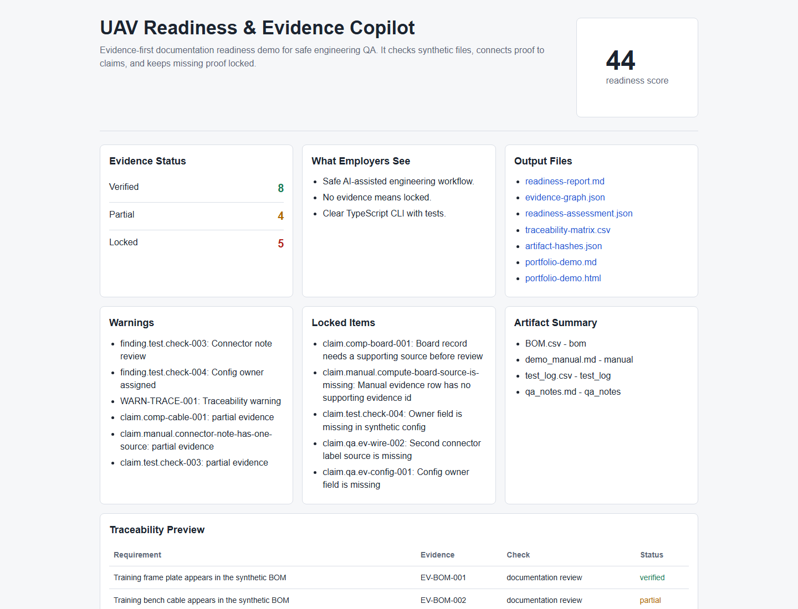

# UAV Readiness & Evidence Copilot

[](https://github.com/DenisShumilov/uav-readiness-evidence-copilot/actions/workflows/ci.yml)

Evidence-first documentation readiness tool for safe UAV and robotics engineering QA.

Simple meaning:

- UAV = unmanned aerial vehicle, or drone.
- QA = quality assurance, meaning checking that work is complete and reliable.
- evidence = proof, such as a document, note, table, or log.
- readiness = documentation readiness, not permission to operate equipment.
- locked = blocked because proof is missing.

## What This Project Is

UAV Readiness & Evidence Copilot is an offline TypeScript tool that turns safe demo engineering files into a documentation readiness report.

It reads synthetic input files, checks whether claims have evidence, marks unsupported claims as `locked`, builds an evidence graph, calculates a readiness score, and writes recruiter-friendly output files.

## Why It Helps UAV / Miltech Engineering Teams

Engineering teams often need to prove that documentation, QA checks, and review records are complete before a product review or audit.

This project shows a safe workflow for:

- organizing engineering evidence;
- finding missing proof early;
- connecting requirements to evidence and checks;
- creating clear review reports;
- keeping unsafe operational scope out of the tool.

Simple meaning: it helps a team see what paperwork is ready, what is weak, and what is blocked.

## What This Project Does Not Do

This project does not:

- control drones or robots;
- plan missions;
- generate routes or waypoints;
- process live telemetry;
- select or control payloads;
- support targeting;
- provide tactical advice;
- connect to real aircraft, radios, sensors, or field systems.

It is a documentation, QA, evidence, and portfolio demo only.

## 30-second demo

Run:

```powershell
npm run demo:readiness
```

Open:

```text
examples/demo-uav-readiness/output/portfolio-demo.html
```

In one page, the demo shows:

- project name and purpose;
- readiness score;
- verified / partial / locked evidence counts;
- warnings;
- locked items;
- generated output files;
- why the project is useful to an employer.

## Live / Local Demo

Run:

```powershell
npm install
npm run demo:readiness
```

Open:

```text
examples/demo-uav-readiness/output/portfolio-demo.html
```

The page shows a product-style overview: score, evidence counters, warnings, locked steps, generated outputs, before/after workflow, safety boundary, and technical pipeline.

## Demo Screenshot



This screenshot shows the browser-friendly demo page with the readiness score, evidence status, warnings, locked items, output files, and traceability preview.

Generate the latest HTML demo:

```powershell
npm run demo:readiness
```

Then open:

```text
examples/demo-uav-readiness/output/portfolio-demo.html
```

## Explain Like I Am New

Seven key ideas:

- Parser = code that reads a file and pulls useful data from it.
- Schema = rules for what valid data must look like.
- Evidence = proof from a file, note, table, or log.
- Evidence graph = a map that connects claims to proof.
- Locked step = a claim or check that stays blocked because proof is missing.
- Readiness score = documentation readiness score, not permission to operate equipment.
- Artifact hash = a digital fingerprint that helps show which file was reviewed.

1-minute pitch:

> This project is a safe AI-assisted QA workspace for UAV engineering documentation. It reads synthetic demo artifacts, checks which claims have evidence, marks missing proof as locked, builds traceability, calculates a documentation readiness score, and generates portfolio-ready reports. It proves I can build useful engineering tooling while keeping strict safety boundaries.

30-second pitch:

> It is a documentation QA tool for UAV engineering artifacts. It turns messy files into an evidence-backed readiness package and refuses to verify anything without proof.

10-second pitch:

> It is a safe evidence checker for engineering documents.

## Interview Prep

Read [docs/interview-cheat-sheet.md](docs/interview-cheat-sheet.md) before sharing the GitHub link or talking to a recruiter.

It explains the project, the main terms, a short interview pitch, and 10 likely questions with simple answers.

## How To Run

Install dependencies:

```powershell
npm install
```

Generate the demo outputs:

```powershell
npm run demo:readiness
```

Run checks:

```powershell
npm run typecheck
npm test
npm audit --audit-level=moderate
```

## Input Files

Safe demo inputs live in:

```text
examples/demo-uav-readiness/
```

Current inputs:

- `BOM.csv` = bill of materials, meaning a list of parts.
- `demo_manual.md` = synthetic manual, meaning a fake instruction document for learning.
- `test_log.csv` = QA test log, meaning a table of review checks.
- `qa_notes.md` = QA notes, meaning written quality review notes.
- `wiring_notes.yaml` = documentation-only wiring notes, not real instructions.
- `config_dump.txt` = fake config dump, meaning a fake settings file.

Only the safer documentation inputs are parsed in the current MVP.

## Output Files

Generated outputs live in:

```text
examples/demo-uav-readiness/output/
```

Current outputs:

- `portfolio-demo.md` = one-page recruiter demo.
- `portfolio-demo.html` = browser-friendly recruiter demo page.
- `readiness-report.md` = markdown readiness report.
- `evidence-graph.json` = evidence graph, meaning a map of claims and proof.
- `readiness-assessment.json` = readiness score and findings.
- `traceability-matrix.csv` = table linking requirement -> evidence -> check -> status -> risk.
- `artifact-hashes.json` = file hashes, meaning digital fingerprints for input files.

## Architecture Overview

```text
safe demo files
  -> parsers
  -> schemas
  -> evidence graph
  -> readiness rules
  -> reports and demo outputs
```

Main folders:

- `packages/core/` = schemas, meaning rules for valid data.
- `packages/parsers/` = parsers, meaning code that reads files and extracts data.
- `packages/evidence/` = evidence graph builder.
- `packages/rules/` = readiness scoring rules.
- `packages/reports/` = markdown, CSV, hash, and portfolio output generators.
- `packages/qa/` = CLI smoke tests, meaning quick tests that prove the command works.
- `examples/demo-uav-readiness/` = safe synthetic demo files.
- `docs/` = portfolio, safety, and demo documentation.

## Safety Boundaries

Core rule:

```text
No evidence -> locked.
```

The project may discuss prohibited topics only as safety boundaries. It must not provide operational steps, real-world control logic, real coordinates, live telemetry handling, route generation, payload handling, targeting help, or tactical recommendations.

All demo data is synthetic, static, and educational.

## Tech Stack

- TypeScript = JavaScript with type rules.
- Zod = validation library, meaning it checks that data has the expected shape.
- Vitest = test runner, meaning it runs automated checks.
- tsx = TypeScript runner, meaning it runs TypeScript scripts directly.
- Node.js = JavaScript runtime, meaning the tool that runs the project on your computer.

## Roadmap

- Demo video or GIF for the GitHub README.
- GitHub Actions CI for automatic typecheck, tests, and audit.
- Optional dashboard UI if it stays documentation-only and safe.
- Safer documentation-only parsers for remaining synthetic inputs.
- Portfolio outreach package for recruiters and engineering teams.
