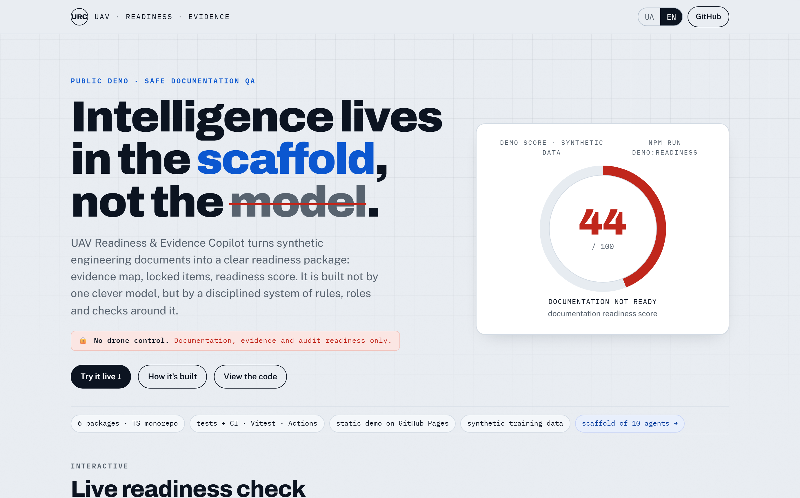

# UAV Readiness & Evidence Copilot

[English version](README.en.md)

> Доказово-орієнтований QA-інструмент для інженерної документації UAV / robotics: карта доказів, заблоковані висновки, оцінка готовності, простежуваність.
>
> **Розум — у каркасі, не в моделі.**

[](https://github.com/DenisShumilov/uav-readiness-evidence-copilot/actions/workflows/ci.yml)
[](https://denisshumilov.github.io/uav-readiness-evidence-copilot/)
[](LICENSE)
[](#технології)
[](#технології)

<p align="center">
  <a href="https://denisshumilov.github.io/uav-readiness-evidence-copilot/">
    
  </a>
</p>

**Жива сторінка:** https://denisshumilov.github.io/uav-readiness-evidence-copilot/ — інтерактивний дашборд: перемикай джерела доказів і дивись, як оцінка готовності перераховується, а твердження стають `locked`.

UAV Readiness & Evidence Copilot читає синтетичні навчальні файли, будує карту доказів, показує заблоковані висновки, рахує оцінку готовності документації і генерує пакет перевірки: матрицю простежуваності, цифрові відбитки файлів, звіт і демо-сторінку. Усе будує не одна модель, а каркас із правил, ролей і перевірок навколо неї.

## TL;DR

- Читає 4 синтетичні навчальні файли (BOM, інструкція, журнал тестів, QA-нотатки).
- Будує карту доказів для тверджень, джерел і блокувань.
- Не вигадує підтверджень: **нема доказу → заблоковано**.
- Рахує оцінку готовності документації прозорими правилами.
- Генерує звіт, JSON, traceability CSV, цифрові відбитки і демо-сторінку.
- Головне: надійність — у каркасі (правила, ролі, перевірки), а не в моделі.

## Демо-відео

Фінальні MP4-відео опубліковані через GitHub Release, а не зберігаються як важкі файли в репозиторії.

- [Онлайн-сторінка демо](https://denisshumilov.github.io/uav-readiness-evidence-copilot/)
- [Українське MP4-демо](https://github.com/DenisShumilov/uav-readiness-evidence-copilot/releases/download/v0.3.0-demo-video/uav-readiness-demo.uk.final.mp4)
- [Англійське MP4-демо](https://github.com/DenisShumilov/uav-readiness-evidence-copilot/releases/download/v0.2.0-demo-video/uav-readiness-demo.en.final.mp4)
- [Реліз українського демо v3](https://github.com/DenisShumilov/uav-readiness-evidence-copilot/releases/tag/v0.3.0-demo-video)
- [Реліз англійського демо](https://github.com/DenisShumilov/uav-readiness-evidence-copilot/releases/tag/v0.2.0-demo-video)

## Що робить

- Читає 4 навчальні вхідні файли.
- Будує карту доказів для тверджень, джерел і блокувань.
- Показує підтверджені, часткові та заблоковані докази.
- Рахує оцінку готовності документації.
- Генерує текстовий звіт, JSON, CSV і HTML-сторінки.
- Перевіряється через TypeScript, Vitest, npm audit і GitHub Actions.

## Чому це важливо

Інженерні команди часто мають багато документів, логів і нотаток якості, але не завжди швидко бачать, що реально підтверджено доказами.

Цей проєкт демонструє безпечний внутрішній інструмент для перевірки готовності документації, підготовки до аудиту та передачі матеріалів на рецензування.

Головне правило:

```text
Немає доказу -> заблоковано.
```

## Межі безпеки

Сувора межа безпеки тут — це **перевага, а не дисклеймер**: вона показує інженерну дисципліну й контроль обсягу (scope). Це тільки проєкт для документації, QA і портфоліо.

Проєкт не керує дронами або роботами, не обробляє живі дані з систем, не генерує маршрути або точки руху, не підтримує роботу з корисним навантаженням, наведення, тактичні поради і не підключається до реальних літальних апаратів, радіомодулів, сенсорів або польових систем.

Усі демо-дані навчальні, статичні й не взяті з реального використання.

## Швидкий запуск

```powershell
npm install
npm run demo:readiness
```

Відкрити:

```text
examples/demo-uav-readiness/output/portfolio-demo.uk.html
```

Запустити перевірки:

```powershell
npm run typecheck
npm test
npm audit --audit-level=moderate
```

## Вхідні файли

Активні вхідні файли, які читає MVP:

- `BOM.csv`
- `demo_manual.md`
- `test_log.csv`
- `qa_notes.md`

Майбутні навчальні файли, які поточний MVP ще не читає:

- `future-fixtures/wiring_notes.yaml`
- `future-fixtures/config_dump.txt`

## Результати

Згенеровані результати створюються локально командою `npm run demo:readiness` тут:

```text
examples/demo-uav-readiness/output/
```

Ця папка не зберігається в репозиторії. Для публічного перегляду використовуйте онлайн-демо сторінку та GitHub Release з MP4-відео.

Поточні результати:

- `portfolio-demo.md`
- `portfolio-demo.html`
- `portfolio-demo.en.html`
- `portfolio-demo.uk.html`
- `readiness-report.md`
- `evidence-graph.json`
- `readiness-assessment.json`
- `traceability-matrix.csv`
- `artifact-hashes.json`
- `readiness.sarif` — SARIF 2.1.0 (формат GitHub code scanning)

## Архітектура

```text
навчальні демо-файли
  -> читачі файлів
  -> правила даних
  -> карта доказів
  -> правила оцінки готовності
  -> звіти та демо-сторінки
```

Детальна схема потоку даних: [docs/architecture.md](docs/architecture.md).

## Як це побудовано — каркас із 10 агентів

Цей репозиторій зробила не одна модель, а **каркас (scaffold)**: постійні правила в [AGENTS.md](AGENTS.md), 10 агентів-спеціалістів, 7 готових скілів і обов'язкові перевірки (doubt-gate, red-team, evidence-lock, self-review).

Повний опис із діаграмою, ролями і реальним прикладом відмови агента безпеки: **[docs/scaffold.md](docs/scaffold.md)**.

Головна теза: **інтелект — у каркасі навколо моделі, а не в самій моделі.**

## Технології

Основні технології:

- TypeScript
- Zod
- Vitest
- tsx
- Node.js
- GitHub Actions

Технології для демо-відео:

- Playwright
- ffmpeg

## Документація

- [Як це побудовано — каркас із 10 агентів](docs/scaffold.md)
- [AGENTS.md — ядро правил](AGENTS.md)
- [Як працює оцінка готовності](docs/scoring.md)
- [Схеми виводу та SARIF](schemas/README.md)
- [FAQ про проєкт](docs/project-faq.md)
- [Архітектура](docs/architecture.md)
- [Межі безпеки](docs/safety-boundaries.md)
- [Модель доказів](docs/evidence-model.md)
- [Політика демо-даних](docs/demo-data-policy.md)
- [Словник понять](docs/glossary.md)
