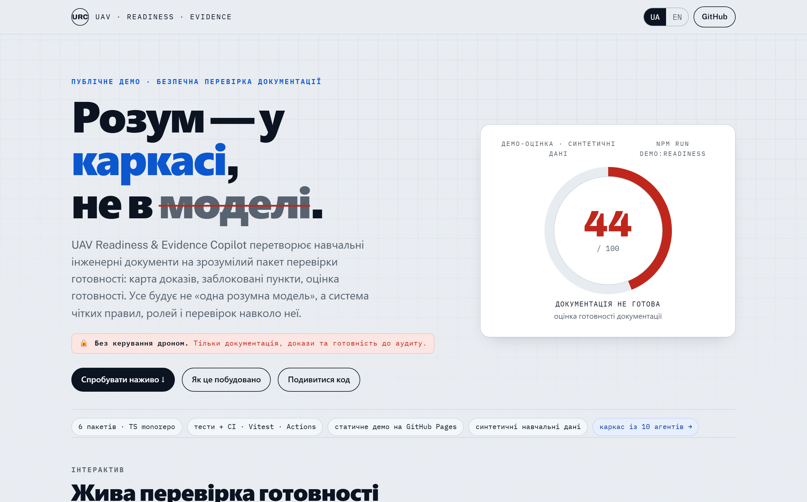

# UAV Readiness & Evidence Copilot

[English version](README.md)

> Доказово-орієнтований QA-інструмент для інженерної документації UAV / robotics: карта доказів, заблоковані висновки, оцінка готовності, простежуваність.
>
> **Розум — у каркасі, не в моделі.**

[](https://github.com/DenisShumilov/uav-readiness-evidence-copilot/actions/workflows/ci.yml)
[](https://denisshumilov.github.io/uav-readiness-evidence-copilot/)
[](LICENSE)
[](#технології)
[](#технології)

**10** агентів · **7** скілів · **1** рантайм-гейт · **94** тестів · **5** форматів експорту · **4** демо-набори · **2** мови

<p align="center">
  <a href="https://denisshumilov.github.io/uav-readiness-evidence-copilot/">
    
  </a>
</p>

*Суворе демо навмисно має 44/100 — немає доказу означає locked. Інструмент не ставить штамп автоматично.*

<p align="center">
  
</p>

## Запусти на своїй документації

### 1. CLI за хвилину

```bash
npx github:DenisShumilov/uav-readiness-evidence-copilot check ./docs
```

Нульове налаштування, миттєвий вивід на вбудованому суворому наборі, тека docs не потрібна:

```bash
npx github:DenisShumilov/uav-readiness-evidence-copilot demo
```

Для власної документації `check <dir>` знаходить тільки ці чотири входи з contract-based detection
(розпізнаванням за очікуваною формою файлу):

- BOM CSV: будь-який `.csv` з `item_id,item_name,category,quantity,revision,record_status,evidence_id,notes`
- Markdown-інструкція: рядок `SYNTHETIC DEMO` і таблиця `| Claim | Status | Evidence |`
- CSV журналу перевірок: будь-який `.csv` з `check_id,check_name,check_type,result,evidence_status,evidence_id,notes`
- Markdown QA-нотаток: рядок `SYNTHETIC DEMO`, таблиця `| Evidence ID | Status | Meaning |` і поля `Finding ID` / `Status` / `Reason` / `Impact`

Розпізнавання contract-based: усе інше показується як skipped (пропущено), `--help` друкує ці
contracts, а відсутній доказ лишається `locked` за задумом.

### 2. GitHub Action

```yaml
name: Docs Evidence

on: [pull_request]

jobs:
  readiness:
    runs-on: ubuntu-latest
    permissions:
      contents: read
      security-events: write
    steps:
      - uses: actions/checkout@v6
      - id: readiness
        uses: DenisShumilov/uav-readiness-evidence-copilot@main
        with:
          path: docs
          min-score: 70
      - uses: github/codeql-action/upload-sarif@v4
        with:
          sarif_file: ${{ steps.readiness.outputs.sarif }}
          category: uav-readiness
```

### 3. Вбудоване суворе демо

```bash
npm run demo:readiness
```

**Спробуй за 10 секунд — без встановлення:** https://denisshumilov.github.io/uav-readiness-evidence-copilot/ — інтерактивний дашборд: перемикай джерела доказів і дивись, як оцінка готовності перераховується, а твердження стають `locked`.

Побудовано каркасом із 10 Claude-субагентів, 7 скілів і рантайм-гейта, який блокує небезпечні правки — [як це побудовано](docs/scaffold.md).

Дай йому документацію проєкту дрона (перелік частин, інструкцію, журнал тестів, QA-нотатки), і він покаже — з доказами — які твердження справді підтверджені та наскільки готова документація.

UAV Readiness & Evidence Copilot читає синтетичні навчальні файли, будує карту доказів, показує заблоковані висновки, рахує оцінку готовності документації і генерує пакет перевірки: матрицю простежуваності, цифрові відбитки файлів, SARIF для code scanning, звіт і демо-сторінку. Усе будує не одна модель, а каркас із правил, ролей і перевірок навколо неї.

## TL;DR

- Читає 4 синтетичні навчальні файли (BOM, інструкція, журнал тестів, QA-нотатки).
- Будує карту доказів для тверджень, джерел і блокувань.
- **Виводить** кожен статус зі змісту доказів, а не довіряє мітці рецензента: `нема доказу → locked`, а тест-твердження оцінюються за власним результатом перевірки.
- **Виведена суперечність між документами обмежує вердикт зоною Blocked, навіть якщо кожен рядок вручну позначено "verified"** — конфліктне демо дає **49/100 Blocked**.
- Рахує оцінку готовності документації прозорими правилами з cap'ами — а parity-тест тримає формулу живого сайту тотожною рушію.
- Генерує звіт, JSON, traceability CSV, цифрові відбитки, SARIF для code scanning і демо-сторінку.
- Також постачається як CLI і GitHub Action, які можна спрямувати на власну теку документації.
- Головне: надійність — у каркасі (правила, ролі, перевірки і рантайм-гейт), а не в моделі.

## Демо-відео

Фінальні MP4-відео опубліковані через GitHub Release, а не зберігаються як важкі файли в репозиторії.

*Записано з поточного живого сайту, включно з панелями evidence graph і conflict gate.*

- [Онлайн-сторінка демо](https://denisshumilov.github.io/uav-readiness-evidence-copilot/)
- [Українське MP4-демо](https://github.com/DenisShumilov/uav-readiness-evidence-copilot/releases/download/v0.7.0-demo-video/uav-readiness-demo.uk.final.mp4)
- [Англійське MP4-демо](https://github.com/DenisShumilov/uav-readiness-evidence-copilot/releases/download/v0.7.0-demo-video/uav-readiness-demo.en.final.mp4)
- [Реліз демо-відео v7 (гейт конфлікту + граф доказів)](https://github.com/DenisShumilov/uav-readiness-evidence-copilot/releases/tag/v0.7.0-demo-video)

## Що робить

- Читає 4 навчальні вхідні файли.
- Будує карту доказів для тверджень, джерел і блокувань.
- Показує підтверджені, часткові та заблоковані докази.
- Рахує оцінку готовності документації.
- Генерує текстовий звіт, JSON, CSV, SARIF для code scanning і HTML-сторінки.
- Перевіряється через TypeScript, Vitest, npm audit і GitHub Actions.

## Чому це важливо

Інженерні команди часто мають багато документів, логів і нотаток якості, але не завжди швидко бачать, що реально підтверджено доказами.

Цей проєкт демонструє безпечний внутрішній інструмент для перевірки готовності документації, підготовки до аудиту та передачі матеріалів на рецензування.

## Чому це резонує в defense-tech документації

Defense-tech документація тримається на evidence packages (пакетах доказів): записах, індексах, простежуваності та чергах рецензування. Цей проєкт повторює цю культуру в малому навчальному масштабі: він не вважає твердження ready, якщо доказ відсутній або джерела суперечать одне одному. Нове [Technical Data Package (TDP, технічний пакет даних)-style демо пакета постачальника](examples/demo-tdp-supplier-package/README.md) показує впізнаваний intake-сценарій: пакет надійшов, ревізії не збіглися, і оцінка лишилася в зоні Blocked. Дивись категорійну [мапу стандартів](docs/standards.md). Жодних заяв про відповідність стандартам тут немає.

Головне правило:

```text
Немає доказу -> заблоковано.
```

## Межі безпеки

Сувора межа безпеки тут — це **перевага, а не дисклеймер**: вона показує інженерну дисципліну й контроль обсягу (scope). Це тільки проєкт для документації, QA і портфоліо.

Проєкт не керує дронами або роботами, не обробляє живі дані з систем, не генерує маршрути або точки руху, не підтримує роботу з корисним навантаженням, наведення, тактичні поради і не підключається до реальних літальних апаратів, радіомодулів, сенсорів або польових систем.

Усі демо-дані навчальні, статичні й не взяті з реального використання.
Це примусово виконується, а не лише обіцяється: протестований PreToolUse-гейт блокує будь-яку правку з операційною термінологією (див. закомічений приклад логу і `packages/qa/src/scaffoldGate.test.ts`).

## Швидкий запуск

```bash
npm install
npm run demo:readiness
```

Відкрити:

```text
examples/demo-uav-readiness/output/portfolio-demo.uk.html
```

Запустити перевірки:

```bash
npm run typecheck
npm test
npm audit --audit-level=moderate
```

## Чотири демо-набори

- `npm run demo:readiness` — суворий набір `demo-uav-readiness` (**44/100**, «не готово»): багато прогалин і заблокованих пунктів.
- `npm run demo:maintenance` — здебільшого зібраний набір `demo-maintenance-readiness` (**80/100**, «придатний до огляду, але неповний»): той самий конвеєр, інша форма документів, інший результат.
- `npm run demo:conflict` — набір `demo-conflict-readiness` (**49/100**): майже все підтверджено, але одна **суперечність** між джерелами — і conflict-gate сам опускає вердикт у зону «заблоковано» (за дедукціями було б ~90).
- `npm run demo:tdp` — набір `demo-tdp-supplier-package` (**49/100**, Blocked): Technical Data Package (TDP, технічний пакет даних)-style worksheet постачальника з двома locked-твердженнями, одним partial cross-reference і виведеним конфліктом ревізій.

Це показує, що інструмент працює на різних наборах і не «штампує» оцінку — він усе одно лишає `partial`, `locked` і не дає «готово», якщо джерела суперечать одне одному.

## Self-audit на реальному змісті

`npm run demo:selfaudit` наводить **той самий рушій** на ВЛАСНУ реальну документацію репозиторію (не синтетику): запускає **10 перевірок** — задокументовані оцінки демо, «10 агентів / 7 скілів», виведений count тестів у README, двомовні двійники, наявність ассетів і збіг release tag (мітки релізу) на live-site з `README.md`. Чистий репозиторій дає **100/100 без жодного override** — а щойно док «дрейфне» (застаріла оцінка, відсутній двійник або застарілий release tag), рушій **перекриває** задокументоване твердження (`verified -> locked`) і **CI падає**. Це рушій виводить вердикт на вводі, який сам не писав.

> **Що це ще НЕ доводить:** чотири демо-набори синтетичні й внутрішньо узгоджені, тож на них рушій лише відтворює мітки рецензента (там він ще *не* ловив людську помилку — `engineAdjustedCount === 0` за задумом). Self-audit — це перше місце, де рушій працює на **реальному змісті, якого не писав**, і він вшитий у CI, щоб дрейф документації не повернувся.

## Вхідні файли

Активні вхідні файли, які читає MVP:

- `BOM.csv`
- `demo_manual.md`
- `test_log.csv`
- `qa_notes.md`

Майбутні навчальні файли, які поточний MVP ще не читає:

- `future-fixtures/wiring_notes.yaml`
- `future-fixtures/config_dump.txt`

## Результати

Згенеровані результати створюються локально командою `npm run demo:readiness` тут:

```text
examples/demo-uav-readiness/output/
```

Ця папка не зберігається в репозиторії. Для публічного перегляду використовуйте онлайн-демо сторінку та GitHub Release з MP4-відео.

Поточні результати:

- `portfolio-demo.md`
- `portfolio-demo.html`
- `portfolio-demo.en.html`
- `portfolio-demo.uk.html`
- `readiness-report.md`
- `evidence-graph.json`
- `readiness-assessment.json`
- `traceability-matrix.csv`
- `artifact-hashes.json`
- `readiness.sarif` — SARIF 2.1.0 (формат GitHub code scanning)

## Архітектура

```text
навчальні демо-файли
  -> читачі файлів
  -> правила даних
  -> карта доказів
  -> правила оцінки готовності
  -> звіти та демо-сторінки
```

Детальна схема потоку даних: [docs/architecture.md](docs/architecture.md).

## Як це побудовано — каркас із 10 агентів

Цей репозиторій зробила не одна модель, а **каркас (scaffold)**: постійні правила в [AGENTS.md](AGENTS.md), 10 агентів-спеціалістів, 7 готових скілів і обов'язкові перевірки (doubt-gate, red-team, evidence-lock, self-review).

Повний опис із діаграмою, ролями і реальним прикладом відмови агента безпеки: **[docs/scaffold.md](docs/scaffold.md)**.
Реальні файли каркаса (10 субагентів + 7 скілів, кожен окремо): **[meta/ai-workflows/](meta/ai-workflows/README.md)**.

Каркас має й **рантайм-зуби**: хук `PreToolUse` ([meta/ai-workflows/hooks/scaffold-gate.mjs](meta/ai-workflows/hooks/scaffold-gate.mjs), підключений у [.claude/settings.json](.claude/settings.json)) логує кожен виклик інструмента і **блокує** будь-яку правку чи команду з операційною UAV-термінологією — межа «тільки QA документації» стає вимірюваним, *протестованим* правилом, а не лише промптом. Закомічений [приклад логу](meta/ai-workflows/scaffold-activity.sample.log) показує, як гейт пропускає правку доків і відхиляє правку з «mission/route».

Головна теза: **інтелект — у каркасі навколо моделі, а не в самій моделі.**

## Технології

Основні технології:

- TypeScript
- Zod
- Vitest
- tsx
- Node.js
- GitHub Actions

Технології для демо-відео:

- Playwright
- ffmpeg

## Документація

- [Як це побудовано — каркас із 10 агентів](docs/scaffold.md)
- [AGENTS.md — ядро правил](AGENTS.uk.md)
- [Як працює оцінка готовності](docs/scoring.md)
- [Як це лягає на реальну практику документації](docs/standards.md)
- [Схеми виводу та SARIF](schemas/README.uk.md)
- [FAQ про проєкт](docs/project-faq.md)
- [Архітектура](docs/architecture.md)
- [Межі безпеки](docs/safety-boundaries.md)
- [Модель доказів](docs/evidence-model.md)
- [Політика демо-даних](docs/demo-data-policy.md)
- [Словник понять](docs/glossary.md)

## Про автора

Проєкт створив **Денис Шумілов** — інженер, що працює над доказовими AI-інструментами із запобіжниками. Теза, яку демонструє це репо: інтелект — у каркасі, а не в моделі.

Якщо ваша команда будує агентну інфраструктуру, системи доказової документації або defense-tech інструменти — напишіть мені.

[LinkedIn](https://www.linkedin.com/in/denis-shumilov/) · [GitHub](https://github.com/DenisShumilov) · shumilov1999@gmail.com
