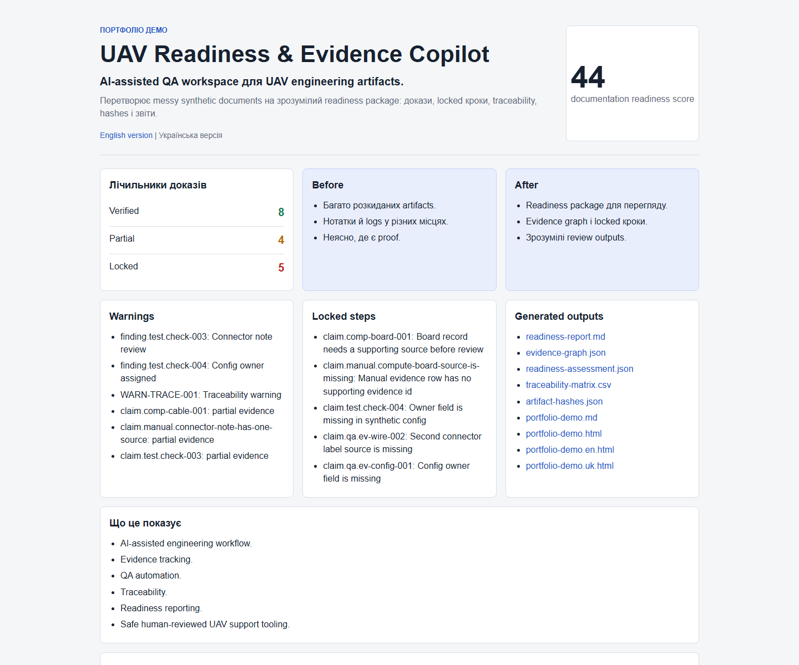
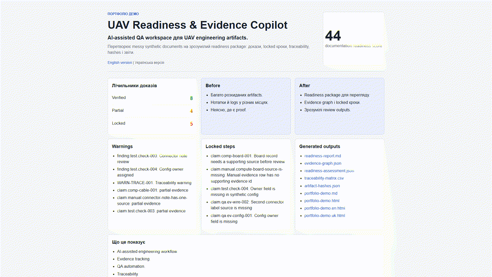

# UAV Readiness & Evidence Copilot

[English README](README.md)

Evidence-first інструмент для безпечної UAV/robotics документації, QA, evidence tracking і readiness reporting.

Простими словами:

- UAV = безпілотник або дрон.
- QA = перевірка якості.
- evidence = доказ, наприклад документ, таблиця, log або note.
- readiness = готовність документації, не дозвіл на роботу реальної системи.
- locked = заблоковано, бо доказу немає.

## Що це за проєкт

UAV Readiness & Evidence Copilot — це offline TypeScript tool, який бере synthetic demo files і створює зрозумілий readiness package.

Він читає demo-файли, перевіряє докази, будує evidence graph, показує locked steps, рахує documentation readiness score і генерує звіти.

Це не drone control. Це QA-інспектор для документації.

## Чому це корисно

У UAV/miltech engineering командах часто є багато документів, logs, lists, notes і review comments.

Проблема: швидко зрозуміти, що підтверджено доказом, що partial, а що треба заблокувати.

Цей проєкт показує safe workflow:

- зібрати evidence;
- показати verified / partial / locked;
- зробити traceability matrix;
- створити readiness report;
- не вигадувати proof.

## 30-second demo

Запусти:

```powershell
npm install
npm run demo:readiness
```

Відкрий:

```text
examples/demo-uav-readiness/output/portfolio-demo.uk.html
```

Також є English demo:

```text
examples/demo-uav-readiness/output/portfolio-demo.en.html
```

## Demo screenshot



На screenshot видно score, evidence counters, warnings, locked steps і generated outputs.

## Demo video



Сценарій і voiceover лежать тут:

- [demo-video/storyboard.uk.md](demo-video/storyboard.uk.md)
- [demo-video/voiceover.uk.txt](demo-video/voiceover.uk.txt)
- [demo-video/README.md](demo-video/README.md)

Майбутній video/GIF шлях:

```text
demo-video/videos/uav-readiness-demo.uk.mp4
demo-video/videos/uav-readiness-demo.uk.gif
```

Поки MP4/GIF ще не створений, використай [docs/assets/demo-video-gif.placeholder.md](docs/assets/demo-video-gif.placeholder.md).

Поточний GIF preview:

```text
demo-video/videos/uav-readiness-demo.uk.gif
```

Автоматичний capture:

```powershell
npm run demo:video:screenshots
npm run demo:video:record
```

## Що я маю сказати рекрутеру

Коротко:

> Я зробив safe TypeScript QA tool для UAV engineering documentation. Він читає synthetic demo files, будує карту доказів, показує locked steps, рахує documentation readiness score і генерує звіти.

Ще коротше:

> Це QA-інспектор для UAV-документації, не система керування дроном.

## Чого проєкт НЕ робить

Він не:

- керує дронами;
- працює з real equipment;
- аналізує live data;
- будує маршрути;
- працює з бойовими сценаріями;
- є production tool.

## Основні команди

```powershell
npm run demo:readiness
npm run typecheck
npm test
npm audit --audit-level=moderate
```

## Де підготуватися до співбесіди

- [docs/final-interview-pack.uk.md](docs/final-interview-pack.uk.md)
- [docs/final-portfolio-package.uk.md](docs/final-portfolio-package.uk.md)
