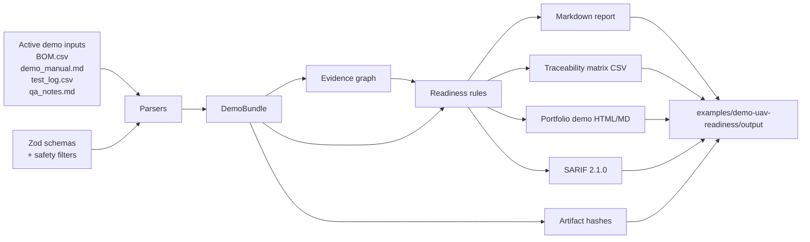

# Architecture

*[Українською](architecture.md) · English*

UAV Readiness & Evidence Copilot is a documentation QA pipeline built around one rule:

```text
No evidence -> locked.
```

## Data Flow



## Runtime Path

- `scripts/demoReadiness.ts` orchestrates the demo command.
- `packages/parsers/` reads the active synthetic inputs.
- `packages/core/` validates structured data with TypeScript/Zod schemas.
- `packages/evidence/` builds the evidence graph.
- `packages/rules/` evaluates readiness with deterministic scoring.
- `packages/reports/` writes Markdown, JSON, CSV, hash, and portfolio outputs.

## Active Inputs

The current MVP reads:

- `examples/demo-uav-readiness/BOM.csv`
- `examples/demo-uav-readiness/demo_manual.md`
- `examples/demo-uav-readiness/test_log.csv`
- `examples/demo-uav-readiness/qa_notes.md`

Future fixtures are stored under:

```text
examples/demo-uav-readiness/future-fixtures/
```

They are not parsed by the current MVP.

## Generated Outputs

The demo command writes:

- `readiness-report.md`
- `evidence-graph.json`
- `readiness-assessment.json`
- `traceability-matrix.csv`
- `artifact-hashes.json`
- `readiness.sarif`
- `portfolio-demo.md`
- `portfolio-demo.html`
- `portfolio-demo.en.html`
- `portfolio-demo.uk.html`

## Safety Boundary

The system evaluates documentation readiness only. It must not become a drone control, route planning, payload, targeting, telemetry, or tactical workflow.
