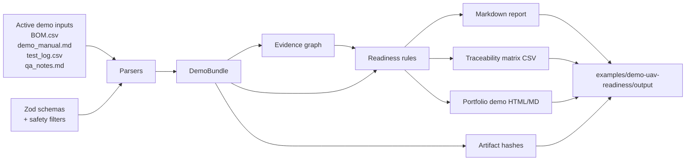

# Архітектура

*Українською · [English](architecture.en.md)*

UAV Readiness & Evidence Copilot (помічник з оцінки готовності та доказів для БПЛА) — це конвеєр контролю якості документації (QA, quality assurance), побудований навколо одного правила:

```text
No evidence -> locked.
```

(Немає доказів — заблоковано.)

## Потік даних (Data Flow)



## Шлях виконання (Runtime Path)

- `scripts/demoReadiness.ts` оркеструє (керує послідовністю виконання) демонстраційну команду.
- `packages/parsers/` зчитує активні синтетичні вхідні дані.
- `packages/core/` валідує (перевіряє) структуровані дані за допомогою схем TypeScript/Zod.
- `packages/evidence/` будує граф доказів (evidence graph).
- `packages/rules/` обчислює готовність за допомогою детермінованого нарахування балів (deterministic scoring).
- `packages/reports/` записує вихідні файли у форматах Markdown, JSON, CSV, hash та портфоліо.

## Активні вхідні дані (Active Inputs)

Поточний MVP (minimum viable product — мінімально життєздатний продукт) зчитує:

- `examples/demo-uav-readiness/BOM.csv`
- `examples/demo-uav-readiness/demo_manual.md`
- `examples/demo-uav-readiness/test_log.csv`
- `examples/demo-uav-readiness/qa_notes.md`

Майбутні фікстури (fixtures — заздалегідь підготовлені тестові дані) зберігаються в каталозі:

```text
examples/demo-uav-readiness/future-fixtures/
```

Поточний MVP їх не парсить (не обробляє).

## Згенеровані вихідні файли (Generated Outputs)

Демонстраційна команда записує:

- `readiness-report.md`
- `evidence-graph.json`
- `readiness-assessment.json`
- `traceability-matrix.csv`
- `artifact-hashes.json`
- `portfolio-demo.md`
- `portfolio-demo.html`
- `portfolio-demo.en.html`
- `portfolio-demo.uk.html`

## Межа безпеки (Safety Boundary)

Система оцінює виключно готовність документації. Вона не повинна перетворюватися на робочий процес керування дроном, планування маршруту, корисного навантаження, наведення, телеметрії чи тактики.
