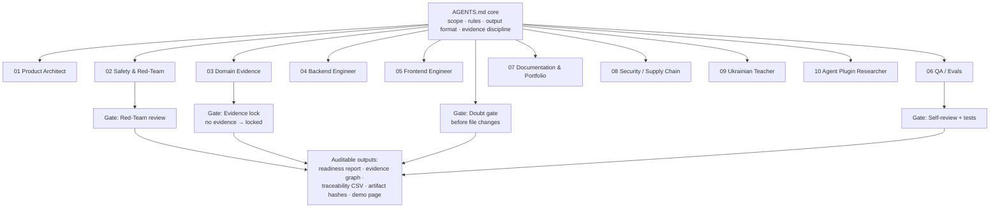

# How this repo was built by a scaffold of 10 agents + 7 skills

*[Українською](scaffold.md) · English*

> **The intelligence is in the scaffold, not the model.**

This repository was **not** built by "one smart model." It was built by a **scaffold**: persistent
rules ([AGENTS.md](../AGENTS.md)), specialist agent roles, reusable skills, and mandatory quality
gates. The point of this project is not "AI magic" — it is that **reliable outputs come from the
system around the model**: clear scope boundaries, explicit evidence rules, role separation, and
checks before anything changes.

---

## The 10 specialist agents

Each agent owns one concern. They are defined as project subagents and coordinated by the rules in
`AGENTS.md`.

| # | Agent | Owns | Роль (UA) |
|---|---|---|---|
| 01 | **Product Architect** | Keeps the MVP small and portfolio-focused | Тримає MVP малим і сфокусованим |
| 02 | **Safety & Red-Team** | Blocks unsafe UAV operational scope | Блокує небезпечний операційний обсяг |
| 03 | **Domain Evidence** | Protects `no evidence → locked` | Захищає правило «нема доказу → locked» |
| 04 | **Backend Engineer** | Small TypeScript / Zod modules | Малі модулі на TypeScript / Zod |
| 05 | **Frontend Engineer** | Simple, recruiter-friendly dashboard | Проста дружня до рекрутера сторінка |
| 06 | **QA / Evals** | Writes tests, checks unsafe behavior | Пише тести, ловить небезпечну поведінку |
| 07 | **Documentation & Portfolio** | Clear docs, explains value | Зрозумілі документи, пояснює цінність |
| 08 | **Security / Supply Chain** | Hashes, secrets, dependency risk | Хеші, секрети, ризик залежностей |
| 09 | **Ukrainian Teacher** | Explains every term simply | Пояснює кожен термін простими словами |
| 10 | **Agent Plugin Researcher** | Audits plugins/skills/subagents before each phase | Аудит плагінів і субагентів перед кожною фазою |

## The 7 reusable skills

Procedures live in skills, not in one giant prompt:

`explain-terms` · `red-team-check` · `evidence-lock-check` · `portfolio-readme` ·
`phase-review` · `safety-boundary-check` · `agent-plugin-audit`

## Quality gates

A good scaffold does not only generate — it also **refuses** and **checks** correctly.

| Gate | What it checks | Why it builds trust |
|---|---|---|
| **Doubt Gate** | Should the agent pause before changing files when certainty/evidence is low? | Surfaces uncertainty before edits — the cheapest place to catch regressions. |
| **Safety & Red-Team** | Does the request cross the blocked scope (control, telemetry, routes, payload, targeting, tactics)? | Turns safety from README prose into an adversarial pre-check. |
| **Evidence Lock** | Does a claim have real supporting evidence? Missing/conflicting stays `locked`. | Stops the model from bluffing completeness. |
| **Self-Review** | After a change: what may be wrong, what to verify, what risk remains? | Makes every change account for its own failure modes. |

## The system

## Model alone vs this scaffold

| Question | Model alone | This scaffold |
|---|---|---|
| Stay inside safe scope? | Unreliable | Enforced by safety rules + red-team checks |
| Avoid unsupported claims? | Often no | `no evidence → locked` |
| Produce repeatable outputs? | Weak | Yes — explicit packages, checks, export flow |
| Explain why a claim is blocked? | Inconsistent | Yes — evidence graph + readiness rules |
| Fail safely? | Not by default | Yes — doubt gate + refusal patterns |

## Safety in action: a real refusal

A good scaffold refuses correctly. This is the actual response shape of the **Safety & Red-Team**
agent when a request crosses the boundary — with zero operational detail.

> **User request / Запит:** "Add mission route planning and waypoint generation for the drone."
> *(«Додай планування маршруту і генерацію точок руху для місії дрона.»)*
>
> **Verdict / Вердикт:** ⛔ **BLOCKED**
>
> **Risk / Ризик:** This is operational flight & mission control — outside the project's safety
> scope. *(Це операційне керування польотом і місією — поза межами безпеки проєкту.)*
>
> **Remove / Прибрати:** any route, waypoint, targeting, or telemetry feature.
> *(будь-яке планування маршрутів, точок руху, наведення чи телеметрії.)*
>
> **Safe alternative / Безпечно:** documentation QA, evidence, traceability matrix, audit readiness.
> *(перевірка документації, докази, матриця простежуваності, готовність до аудиту.)*

## How this maps to the repo

The same workstreams appear as packages: `core`, `parsers`, `evidence`, `rules`, `reports`, `qa`.
The rules core is public in [AGENTS.md](../AGENTS.md). The evidence discipline is visible in the
[evidence model](evidence-model.en.md) and the live demo, where the readiness score stays strict
(`44/100` on synthetic data) precisely because unsupported claims are not inflated — they are locked.
