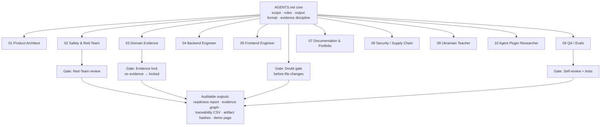

# Як цей репозиторій побудовано каркасом із 10 агентів + 7 скілів

*Українською · [English](scaffold.en.md)*

> **Інтелект — у каркасі (scaffold), а не в моделі.**

Цей репозиторій збудувала **не** «одна розумна модель». Його збудував **каркас (scaffold)** —
постійні правила ([AGENTS.md](../AGENTS.uk.md)), ролі агентів-спеціалістів, повторно використовувані
скіли (skills — готові процедури) та обов'язкові перевірки якості (quality gates). Сенс проєкту не в
«магії штучного інтелекту», а в тому, що **надійний результат дає система навколо моделі**: чіткі межі
обсягу (scope), явні правила доказів (evidence), розподіл ролей і перевірки перед будь-якою зміною.

**Простими словами:** цей проєкт зробила не одна «розумна модель», а каркас (scaffold) — набір
постійних правил, ролей-спеціалістів, готових скілів і обов'язкових перевірок. Саме ця система, а не
сама модель, дає надійний і безпечний результат.

---

> 📂 **Перевір сам:** ці 10 агентів і 7 скілів — реальні файли, а не проза. Відкрий
> [`meta/ai-workflows/`](../meta/ai-workflows/README.md), де кожен субагент і скіл лежить окремим файлом.

## 10 агентів-спеціалістів

Кожен агент відповідає за одну ділянку. Вони визначені як субагенти (subagents) проєкту й
координуються правилами у файлі `AGENTS.md`.

| # | Агент | За що відповідає | Роль (UA) |
|---|---|---|---|
| 01 | **Product Architect** (продуктовий архітектор) | Тримає MVP малим і сфокусованим на портфоліо | Тримає MVP малим і сфокусованим |
| 02 | **Safety & Red-Team** (безпека та «червона команда») | Блокує небезпечний операційний обсяг БПЛА | Блокує небезпечний операційний обсяг |
| 03 | **Domain Evidence** (доменні докази) | Захищає правило `no evidence → locked` | Захищає правило «нема доказу → locked» |
| 04 | **Backend Engineer** (інженер бекенду) | Малі модулі на TypeScript / Zod | Малі модулі на TypeScript / Zod |
| 05 | **Frontend Engineer** (інженер фронтенду) | Проста, дружня до рекрутера сторінка | Проста дружня до рекрутера сторінка |
| 06 | **QA / Evals** (тестування та оцінювання) | Пише тести, ловить небезпечну поведінку | Пише тести, ловить небезпечну поведінку |
| 07 | **Documentation & Portfolio** (документація і портфоліо) | Зрозумілі документи, пояснює цінність | Зрозумілі документи, пояснює цінність |
| 08 | **Security / Supply Chain** (безпека та ланцюг постачання) | Хеші, секрети, ризик залежностей | Хеші, секрети, ризик залежностей |
| 09 | **Ukrainian Teacher** (вчитель української) | Пояснює кожен термін простими словами | Пояснює кожен термін простими словами |
| 10 | **Agent Plugin Researcher** (дослідник плагінів агентів) | Аудит плагінів/скілів/субагентів перед кожною фазою | Аудит плагінів і субагентів перед кожною фазою |

## 7 повторно використовуваних скілів

Процедури живуть у скілах (skills), а не в одному гігантському промпті:

`explain-terms` · `red-team-check` · `evidence-lock-check` · `portfolio-readme` ·
`phase-review` · `safety-boundary-check` · `agent-plugin-audit`

## Перевірки якості (quality gates)

Добрий каркас не лише генерує — він також правильно **відмовляє** та **перевіряє**.

| Перевірка (gate) | Що перевіряє | Чому це створює довіру |
|---|---|---|
| **Doubt Gate** (ворота сумніву) | Чи має агент зупинитися перед зміною файлів, коли впевненість/докази низькі? | Виводить невизначеність на поверхню ще до правок — це найдешевше місце, щоб зловити регресії. |
| **Safety & Red-Team** (безпека та «червона команда») | Чи перетинає запит заблокований обсяг (керування, телеметрія, маршрути, корисне навантаження, наведення, тактика)? | Перетворює безпеку з тексту в README на змагальну попередню перевірку. |
| **Evidence Lock** (блокування за доказами) | Чи має твердження реальні підтверджувальні докази? Відсутні/суперечливі лишаються `locked`. | Не дає моделі блефувати про повноту. |
| **Self-Review** (самоперевірка) | Після зміни: що може бути не так, що перевірити, який ризик лишається? | Змушує кожну зміну відповідати за власні режими відмови. |

## Система

## Сама модель проти цього каркаса

| Питання | Сама модель | Цей каркас |
|---|---|---|
| Лишатися в межах безпечного обсягу? | Ненадійно | Забезпечено правилами безпеки + перевірками «червоної команди» |
| Уникати непідтверджених тверджень? | Часто ні | `no evidence → locked` |
| Давати відтворювані результати? | Слабко | Так — явні пакети, перевірки, потік експорту |
| Пояснити, чому твердження заблоковано? | Непослідовно | Так — граф доказів + правила готовності |
| Безпечно відмовляти? | Не за замовчуванням | Так — ворота сумніву + шаблони відмов |

## Безпека в дії: реальна відмова

Добрий каркас відмовляє правильно. Це справжня форма відповіді агента **Safety & Red-Team**, коли
запит перетинає межу — без жодних операційних деталей.

> **User request / Запит:** "Add mission route planning and waypoint generation for the drone."
> *(«Додай планування маршруту і генерацію точок руху для місії дрона.»)*
>
> **Verdict / Вердикт:** ⛔ **BLOCKED**
>
> **Risk / Ризик:** This is operational flight & mission control — outside the project's safety
> scope. *(Це операційне керування польотом і місією — поза межами безпеки проєкту.)*
>
> **Remove / Прибрати:** any route, waypoint, targeting, or telemetry feature.
> *(будь-яке планування маршрутів, точок руху, наведення чи телеметрії.)*
>
> **Safe alternative / Безпечно:** documentation QA, evidence, traceability matrix, audit readiness.
> *(перевірка документації, докази, матриця простежуваності, готовність до аудиту.)*

## Рантайм-гейт: від прози до протестованого правила

Відмова вище — це *політика*. Та сама межа також вшита як **виконуваний рантайм-правило**. Хук
`PreToolUse` — [`meta/ai-workflows/hooks/scaffold-gate.mjs`](../meta/ai-workflows/hooks/scaffold-gate.mjs),
підключений у [`.claude/settings.json`](../.claude/settings.json) — запускається перед кожним викликом
`Edit`/`Write`/`Bash`, логує його і **виходить з ненульовим кодом, блокуючи** будь-який виклик, чий
текст містить операційну UAV-термінологію (той самий denylist, який Zod-схеми тримають на рівні типів).

Саме це досвідчені читачі-агентники просять *показати*, а не заявити:

- закомічений [`scaffold-activity.sample.log`](../meta/ai-workflows/scaffold-activity.sample.log)
  показує, як гейт **пропускає** правку доків і **відхиляє** правку з «mission/route»;
- це покрито тестами в [`packages/qa/src/scaffoldGate.test.ts`](../packages/qa/src/scaffoldGate.test.ts),
  які запускають хук і перевіряють, що заборонений виклик інструмента реально блокується (код виходу 2).

Тож для межі безпеки теза «інтелект — у каркасі» стає *вимірюваною*: каркас змінює результат —
виклик, який перетнув би межу, просто не виконується.

## Як це лягає на репозиторій

Ті самі напрями робіт з'являються як пакети: `core`, `parsers`, `evidence`, `rules`, `reports`, `qa`.
Ядро правил публічне у [AGENTS.md](../AGENTS.uk.md). Дисципліну доказів видно в
[моделі доказів](evidence-model.md) та в живому демо, де оцінка готовності лишається строгою
(`44/100` на синтетичних даних) саме тому, що непідтверджені твердження не роздуваються — вони
блокуються (locked).

**Простими словами:** низька демо-оцінка — це не слабкість, а доказ чесності: інструмент не вигадує
підтверджень. Це і є сенс каркаса.
